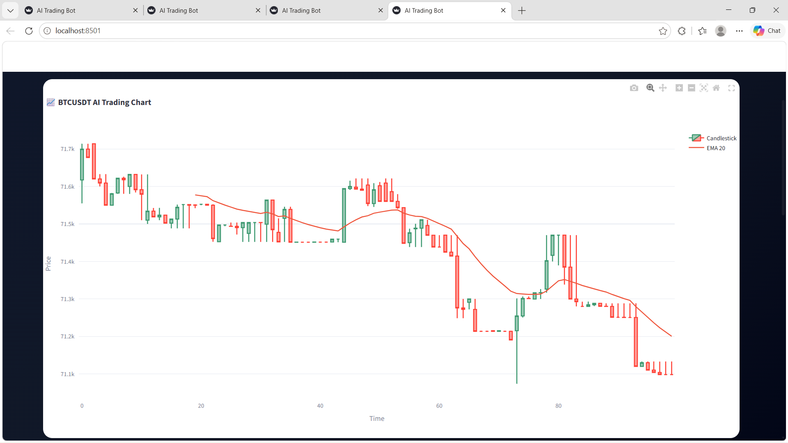
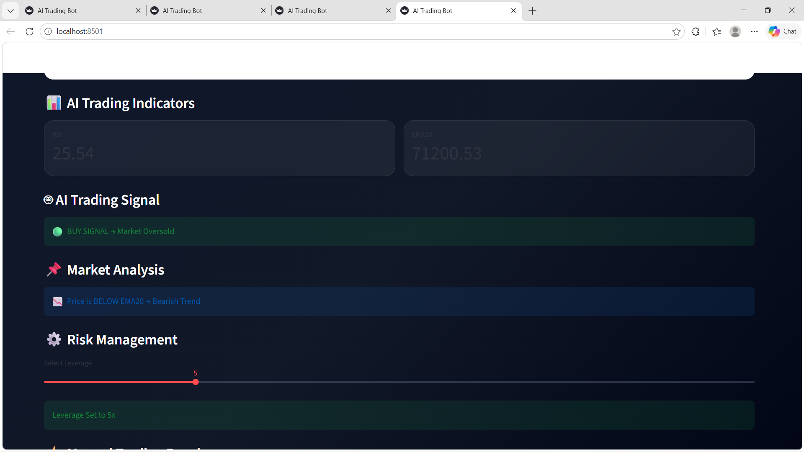
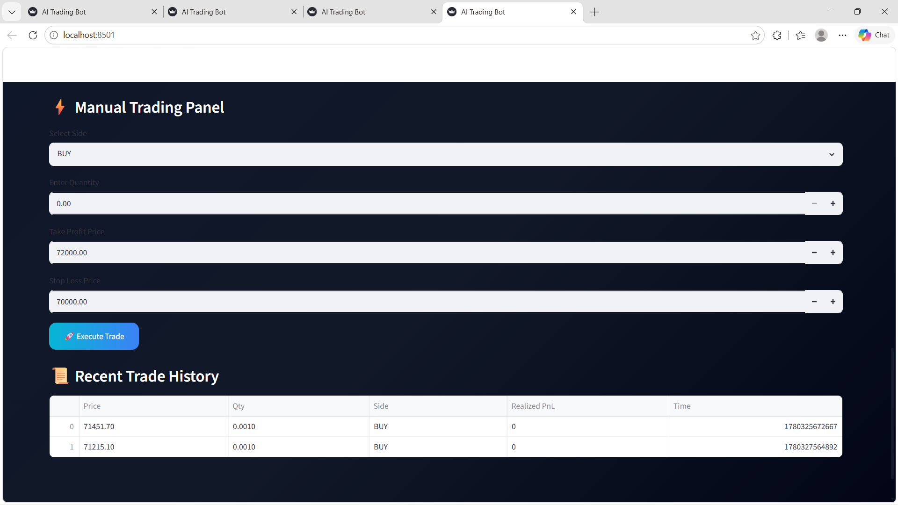

# 🚀 AI Binance Futures Trading Bot

An advanced AI-powered Binance Futures Trading Dashboard built using Python and Streamlit.

[](https://ai-binance-futures-trading-bot-7ol8fmss7dxvza5jfr9nso.streamlit.app/)
---

# ✨ Features

- 📈 Live BTCUSDT Candlestick Chart
- 🤖 AI Trading Signals
- 📊 EMA20 + RSI Indicators
- ⚡ Binance Futures Testnet Integration
- 🛡️ Risk Management System
- 🎯 Take Profit & Stop Loss
- 💹 Manual Trading Panel
- 📜 Recent Trade History
- 🌙 Premium Dark Glass UI

---

# 🛠️ Tech Stack

- Python
- Streamlit
- Binance API
- Plotly
- Pandas
- TA Library

---

# 📂 Project Structure

```bash
trading_bot/
│
├── bot/
│   ├── app.py
│   ├── client.py
│   ├── orders.py
│   ├── validators.py
│   └── logger_config.py
│
├── screenshots/
│
├── requirements.txt
├── README.md
└── .env
```

---

# ⚙️ Installation

## Clone Repository

```bash
git clone https://github.com/Rahul915564/AI-Binance-Futures-Trading-Bot.git
```

## Install Dependencies

```bash
pip install -r requirements.txt
```

## Run Project

```bash
streamlit run bot/app.py
```

---

# 📸 Project Screenshots

## Dashboard


## AI Trading Chart


## Trading Signals


## Risk Management


## Trade History


---

#  Developer

Rahul Kumar

---

# Internship Project

Advanced AI Binance Futures Trading Dashboard developed for internship submission.